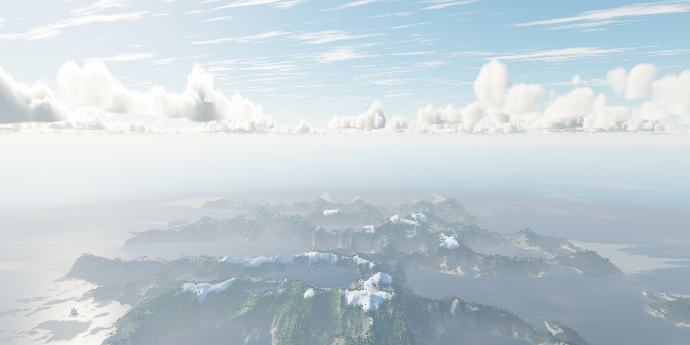

# VistaWASM

> Beautiful, living 3D landscapes in the browser. Give VistaWASM a canvas,
> and it builds a world: mountains, forests, rivers, oceans, clouds, and
> weather.

[](https://github.com/0xe25f/vistawasm/stargazers)
[](https://www.npmjs.com/package/@vista-wasm/vista-wasm)
[](LICENSE)

[](https://0xe25f.github.io/vistawasm/)

**[Try the live demo](https://0xe25f.github.io/vistawasm/)** ·
[Quick start](#quick-start) ·
[Documentation](docs/README.md) ·
[Contributing](CONTRIBUTING.md) ·
[How it compares](#how-it-compares)

If VistaWASM is useful to you, please
**[⭐ star it on GitHub](https://github.com/0xe25f/vistawasm)**. It is the
simplest way to help, and it helps other developers find the project.

## What you get

VistaWASM is a terrain engine written in Rust, compiled to WebAssembly,
and drawn with WebGPU. One package gives you:

- **Terrain from anywhere:** seeded, geology-led worlds (continents,
  ranges carved into valleys, and seven landform presets from alpine to
  volcanic island) with GPU erosion, or real elevation from GeoTIFF files
  and raw heightmaps.
- **Living landscapes:** fifteen climate-driven biomes, eight modelled tree
  species that sway in the wind, grass, and procedural textures generated
  on the GPU, with nothing to download.
- **Water:** an ocean to the horizon with simulated waves and currents,
  plus rivers and lakes that follow the terrain.
- **Sky and weather:** a physically based sky, volumetric clouds from fair
  cumulus to towering storm clouds, cirrus, drifting mist, and a weather
  system with rain, snow, fog, storms, and lightning.
- **Light and shadow:** hills, trees, and clouds all cast shadows.
- **Your assets, your way:** every system can be switched off, tuned, or
  replaced with your own tree models, textures, and placement.
- **A small, typed API:** an async loader, typed options with clear
  errors, and TypeScript declarations for everything.

## Quick start

Install the package:

```bash
npm install @vista-wasm/vista-wasm
```

Give it a canvas and generate a world:

```ts
import { createVistaEngine, initialiseVistaWasm } from "@vista-wasm/vista-wasm";

await initialiseVistaWasm();

const canvas = document.querySelector<HTMLCanvasElement>("#vista");

if (!canvas) {
  throw new Error("Missing canvas element.");
}

const engine = await createVistaEngine(canvas, {
  render: {
    width: canvas.clientWidth,
    height: canvas.clientHeight,
    devicePixelRatio: window.devicePixelRatio
  }
});

const terrain = await engine.generateFractal({
  seed: 12345,
  size: 2048,
  horizontalScaleMetres: 10,
  verticalScale: 1,
  noise: { kind: "ridged", octaves: 7, gain: 0.5, lacunarity: 2 },
  landform: "continental",
  erosion: { quality: "high" }
});

// Look across the terrain from above its highest peak, near one edge.
const { maxHeightMetres, width, metresPerSample } = terrain.metadata;
engine.setCamera({
  position: [0, maxHeightMetres + 400, (width - 1) * metresPerSample * 0.45],
  target: [0, maxHeightMetres * 0.3, 0],
  fieldOfViewDegrees: 55
});

engine.start();
```

Then make it yours:

```ts
engine.setWeather({ enabled: true, state: "rain" });
engine.setClouds({ style: "volumetric", coverage: 0.5, speed: 1, heightMetres: 1800, colour: [1, 1, 1], seedOffset: 1 });
engine.setShadows({ trees: { distanceMetres: 400 } });
```

The package ships pre-built. You do not need Rust or any build tools to
use it.

### What to read next

1. **[Getting started](docs/getting-started.md)**: the full walkthrough,
    covering resizing, disposal, and deployment.
2. **[Options reference](docs/options-reference.md)**: every option, its
    default, and its valid range.
3. **[React, Vue, and Svelte](docs/frameworks.md)**: complete components.
4. **[three.js](docs/threejs.md)**: add three.js objects to a VistaWASM
    world, or draw VistaWASM terrain in a three.js scene.
5. The **[documentation index](docs/README.md)** has a guide for every
    feature: terrain, biomes, vegetation, water, weather, shadows, custom
    assets, games, and more.

### Browser requirements

VistaWASM needs a browser with WebGPU, such as current Chrome or Edge, and
a secure context (HTTPS, or `localhost` while developing). It does not
fall back to WebGL; without WebGPU, `createVistaEngine()` fails with a
clear `WEBGPU_UNAVAILABLE` error, so you can check first with
`detectVistaWasmSupport()` and show a fallback. Serve `.wasm` files as
`application/wasm`.

## Contributing

Contributions of every size are welcome. With Rust 1.87+, Node.js 20.19+,
and `wasm-pack` installed:

```bash
git clone https://github.com/0xe25f/vistawasm.git
cd vistawasm
rustup target add wasm32-unknown-unknown
npm ci
npm run build
npm run dev   # the demo, at http://127.0.0.1:5173/
```

**[CONTRIBUTING.md](CONTRIBUTING.md)** covers the checks to run, where
things live, and what makes a good pull request.
[`docs/architecture.md`](docs/architecture.md) explains how the engine
works.

## How it compares

VistaWASM is a complete, WebGPU-only landscape engine. Two other
open-source projects also make terrain for the web, and both are good
choices for different needs:

- **[THREE.Terrain](https://github.com/IceCreamYou/THREE.Terrain)**
  generates terrain meshes inside a three.js scene, with many noise
  generators and filters, and it runs anywhere WebGL 2 does.
- **[three-terrain](https://github.com/danielesteban/terrain)** turns a
  heightmap into a fast voxel mesh for three.js.

| | VistaWASM | THREE.Terrain | three-terrain |
| --- | --- | --- | --- |
| Runs on | WebGPU | WebGL 2 | WebGL |
| Fits inside an existing three.js scene | [As an overlay or exported mesh](docs/threejs.md) | Yes | Yes |
| Water, sky, clouds, and weather | Included | Not included | Not included |
| Modelled trees, biomes, and shadows | Included | Scattered meshes and grass | Not included |
| Gzipped download, minimal app | 262 KB | 148 KB | 268 KB |
| Time to build a 512 × 512 terrain (median) | 161 ms | 256 ms | 67 ms (voxel mesh of a supplied heightmap) |
| Licence | AGPL-3.0 | MIT | MIT |

Choose VistaWASM for a complete, realistic landscape with little code.
Choose THREE.Terrain to add terrain to a three.js scene, or to reach
browsers without WebGPU. The numbers come from one machine; the
[benchmark page](bench/README.md) explains exactly what each measures,
includes the full feature comparison, and lets you run it yourself.

## Project status

VistaWASM 1.1.0 is stable, typed, and tested: Rust unit tests cover the
terrain, weather, and engine logic, every shader is validated in
`cargo test`, and the TypeScript wrapper has its own tests. See the
[changelog](CHANGELOG.md) for what is new.

## Licence

VistaWASM is licensed under the GNU Affero General Public Licence,
version 3 only (AGPL-3.0-only). See [LICENSE](LICENSE) and
[NOTICE](NOTICE).

If you distribute an application that includes VistaWASM, or offer it to
people over a network, the licence requires you to make that
application's complete source code available to them under the same
licence.

---

Enjoying VistaWASM? **[Star it on GitHub](https://github.com/0xe25f/vistawasm)**,
share what you build, and [open an issue](https://github.com/0xe25f/vistawasm/issues)
if something could be better.
