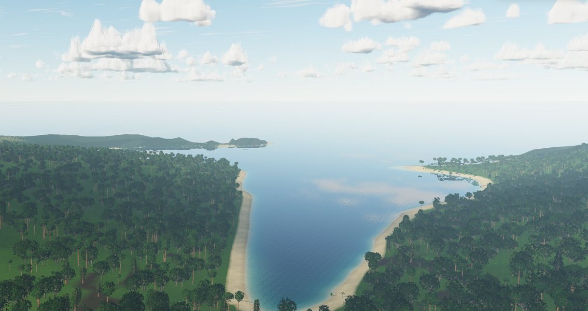

# VistaWASM

> Beautiful, living 3D landscapes in the browser. Give VistaWASM a canvas,
> and it builds a world: mountains, forests, rivers, oceans, clouds, and
> weather.

[](https://github.com/0xe25f/vistawasm/stargazers)
[](https://www.npmjs.com/package/@vista-wasm/vista-wasm)
[](LICENSE)

[](https://0xe25f.github.io/vistawasm/)

**[Try the live demo](https://0xe25f.github.io/vistawasm/demo/)** ([guide](docs/demo.md)) ·
[Website](https://0xe25f.github.io/vistawasm/) ·
[Quick start](#quick-start) ·
[Documentation](docs/README.md) ·
[API](https://0xe25f.github.io/vistawasm/api.html) ·
[Contributing](CONTRIBUTING.md) ·
[How it compares](#how-it-compares)

If VistaWASM is useful to you, please
**[⭐ star it on GitHub](https://github.com/0xe25f/vistawasm)**. It is the
simplest way to help, and it helps other developers find the project.

## What you get

VistaWASM is a terrain engine written in Rust, compiled to WebAssembly,
and drawn with WebGPU. One package gives you:

- **Terrain from anywhere:** seeded, geology-led worlds (continents,
  ranges carved into valleys, and seven landform presets from alpine to
  volcanic island) with GPU erosion, or real elevation from GeoTIFF files
  and raw heightmaps.
- **Living landscapes:** nineteen climate-driven biomes, eight modelled tree
  species that sway in the wind, grass, rock that shows where the soil is
  thin with scree and boulders below it, and procedural textures
  generated on the GPU, with nothing to download.
- **Water:** an ocean to the horizon with simulated waves, currents and
  surf, plus rivers, lakes and waterfalls routed from rain and snowmelt
  and carved into the land.
- **Sky and weather:** a physically based sky, volumetric clouds from fair
  cumulus to towering storm clouds, mid-level and cirrus layers, drifting
  mist, time of day, and thirteen weather presets with rain, snow, fog,
  storms, and lightning.
- **Light and shadow:** hills, trees, and clouds all cast shadows.
- **Your assets, your way:** every system can be switched off, tuned, or
  replaced with your own tree models, textures, and placement.
- **Paint, import, and export:** paint height, biomes, water, and
  vegetation; import them as images; export fifteen maps, every tree, and
  a bundle that loads back exactly.
- **A small, typed API:** an async loader, typed options with clear
  errors, and TypeScript declarations for everything.

## Quick start

Install the package:

```bash
npm install @vista-wasm/vista-wasm
```

Give it a canvas and generate a world:

```ts
import { createVistaEngine, initialiseVistaWasm } from "@vista-wasm/vista-wasm";

await initialiseVistaWasm();

const canvas = document.querySelector<HTMLCanvasElement>("#vista");

if (!canvas) {
  throw new Error("Missing canvas element.");
}

const engine = await createVistaEngine(canvas, {
  render: {
    width: canvas.clientWidth,
    height: canvas.clientHeight,
    devicePixelRatio: window.devicePixelRatio
  }
});

const terrain = await engine.generateFractal({
  seed: 12345,
  size: 2048,
  horizontalScaleMetres: 10,
  verticalScale: 1,
  noise: { kind: "ridged", octaves: 7, gain: 0.5, lacunarity: 2 },
  landform: "continental",
  erosion: { quality: "high" }
});

// Look across the terrain from above its highest peak, near one edge.
const { maxHeightMetres, width, metresPerSample } = terrain.metadata;
engine.setCamera({
  position: [0, maxHeightMetres + 400, (width - 1) * metresPerSample * 0.45],
  target: [0, maxHeightMetres * 0.3, 0],
  fieldOfViewDegrees: 55
});

engine.start();
```

Then make it yours:

```ts
engine.setWeather({ enabled: true, state: "rain" });
engine.setClouds({ style: "volumetric", coverage: 0.5, speed: 1, heightMetres: 1800, colour: [1, 1, 1], seedOffset: 1 });
engine.setShadows({ trees: { distanceMetres: 400 } });
```

The package ships pre-built. You do not need Rust or any build tools to
use it.

### What to read next

1. **[Getting started](docs/getting-started.md)**: the full walkthrough,
    covering resizing, disposal, and deployment.
2. **[Options reference](docs/options-reference.md)**: every option, its
    default, and its valid range.
3. **[React, Vue, and Svelte](docs/frameworks.md)**: complete components.
4. **[three.js](docs/threejs.md)** and **[Babylon.js](docs/babylonjs.md)**:
    add objects to a VistaWASM world, or draw VistaWASM terrain in your
    own scene. Both have runnable examples.
5. The **[API reference](https://0xe25f.github.io/vistawasm/api.html)**
    lists every function, method, event, and error code.
6. The **[documentation index](docs/README.md)** has a guide for every
    feature: terrain, biomes, vegetation, water, weather, shadows, custom
    assets, games, and more.

### Browser requirements

VistaWASM needs a browser with WebGPU, such as current Chrome or Edge, and
a secure context (HTTPS, or `localhost` while developing). It does not
fall back to WebGL; without WebGPU, `createVistaEngine()` fails with a
clear `WEBGPU_UNAVAILABLE` error, so you can check first with
`detectVistaWasmSupport()` and show a fallback. Serve `.wasm` files as
`application/wasm`, and compressed: with Brotli the download is about
18 % smaller than with gzip ([deployment notes](docs/getting-started.md#7-deploy)).

### Security

VistaWASM treats every input as untrusted and checks it against
documented limits. A page with a Content Security Policy needs
`script-src 'self' 'wasm-unsafe-eval'`; no cross-origin isolation headers
are needed. [`docs/security.md`](docs/security.md) has the details, and
[`SECURITY.md`](SECURITY.md) explains how to report a vulnerability
privately.

### Performance

Each scene has a GPU budget: at most 12 ms a frame in the default scene
and 14 ms in rain and in a dense forest, at 1920 x 1080 on a mid-range
GPU. On an NVIDIA RTX 3060 Ti in Chrome and Edge every budgeted scene
is well within its budget, the heaviest, rain, at 4.3 ms.
[`docs/performance.md`](docs/performance.md) lists every budget beside
its scene, with the measured results in Safari and Firefox too, and the
profile page in `bench/gpu/` measures them on your own hardware.

## Contributing

Contributions of every size are welcome. With Rust 1.87+, Node.js 22.12+ (22.x), 24 or 26+,
and `wasm-pack` installed:

```bash
git clone https://github.com/0xe25f/vistawasm.git
cd vistawasm
rustup target add wasm32-unknown-unknown
npm ci
npm run build
npm run dev   # the demo, at http://127.0.0.1:5173/
```

The first build fetches the prebuilt `wasm-bindgen` that matches
`Cargo.lock`, so nothing else needs compiling.

**[CONTRIBUTING.md](CONTRIBUTING.md)** covers the checks to run, where
things live, and what makes a good pull request.
[`docs/architecture.md`](docs/architecture.md) explains how the engine
works.

## How it compares

VistaWASM is a complete, WebGPU-only landscape engine. Three other
open-source projects also put terrain on the web, and each is a good
choice for different needs:

- **[THREE.Terrain](https://github.com/IceCreamYou/THREE.Terrain)**
  generates terrain meshes inside a three.js scene, with many noise
  generators and filters, and it runs anywhere WebGL 2 does.
- **[three-terrain](https://github.com/danielesteban/terrain)** turns a
  heightmap into a fast voxel mesh for three.js.
- **[CesiumJS](https://github.com/CesiumGS/cesium)** is a 3D globe that
  streams real-world terrain, imagery and 3D Tiles for the whole planet.

| | VistaWASM | THREE.Terrain | three-terrain | CesiumJS |
| --- | --- | --- | --- | --- |
| Runs on | WebGPU | WebGL 2 | WebGL | WebGL |
| Fits inside an existing three.js scene | [As an overlay or exported mesh](docs/threejs.md) | Yes | Yes | No |
| Fits inside a Babylon.js scene | [As an overlay or exported mesh](docs/babylonjs.md) | No | No | No |
| Makes terrain | Yes, from tectonics, drainage and erosion | Yes, from noise | No | No |
| Real-world elevation | GeoTIFFs and raw heightmaps, up to 2048 × 2048 | Heightmap images | Heightmap images | The whole planet, streamed |
| Water, sky, clouds, and weather | Included | Not included | Not included | Ocean, sky and fog; no rivers or weather |
| Modelled trees, biomes, and shadows | Included | Scattered meshes and grass | Not included | Shadows only |
| Gzipped download, minimal app | 566 KB | 147 KB | 268 KB | 1,178 KB |
| Time to a 512 × 512 terrain (median) | 623 ms, from tectonics and drainage | 240 ms, from noise | 101 ms (voxel mesh of a supplied heightmap) | 3,830 ms (tiles of a supplied height field) |
| Licence | AGPL-3.0 | MIT | MIT | Apache-2.0 |

Choose VistaWASM for a complete, realistic landscape with little code.
Choose THREE.Terrain for a small, fast terrain mesh in a three.js scene,
or to reach browsers without WebGPU. Choose CesiumJS to show real places
on a globe at any scale, from satellite imagery and streamed terrain.
The numbers come from one machine with software rendering; the
[benchmark page](bench/README.md) explains exactly what each measures,
includes the full feature comparison, and lets you run it yourself.

## Project status

VistaWASM 2.0.0 is stable, typed, and tested: Rust unit tests cover the
terrain, weather, and engine logic, every shader is validated in
`cargo test`, and the TypeScript wrapper and demo have their own tests.
The API only grows from 1.0.0, but saved seeds make new maps and some
defaults changed; the [changelog](CHANGELOG.md#upgrading-from-100) lists
what to check.

## Licence

VistaWASM is licensed under the GNU Affero General Public Licence,
version 3 only (AGPL-3.0-only). See [LICENSE](LICENSE) and
[NOTICE](NOTICE).

If you distribute an application that includes VistaWASM, or offer it to
people over a network, the licence requires you to make that
application's complete source code available to them under the same
licence.

---

Enjoying VistaWASM? **[Star it on GitHub](https://github.com/0xe25f/vistawasm)**,
share what you build, and [open an issue](https://github.com/0xe25f/vistawasm/issues)
if something could be better.
