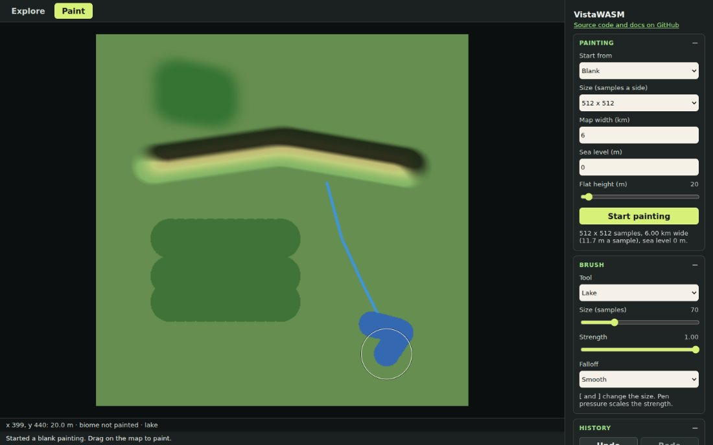
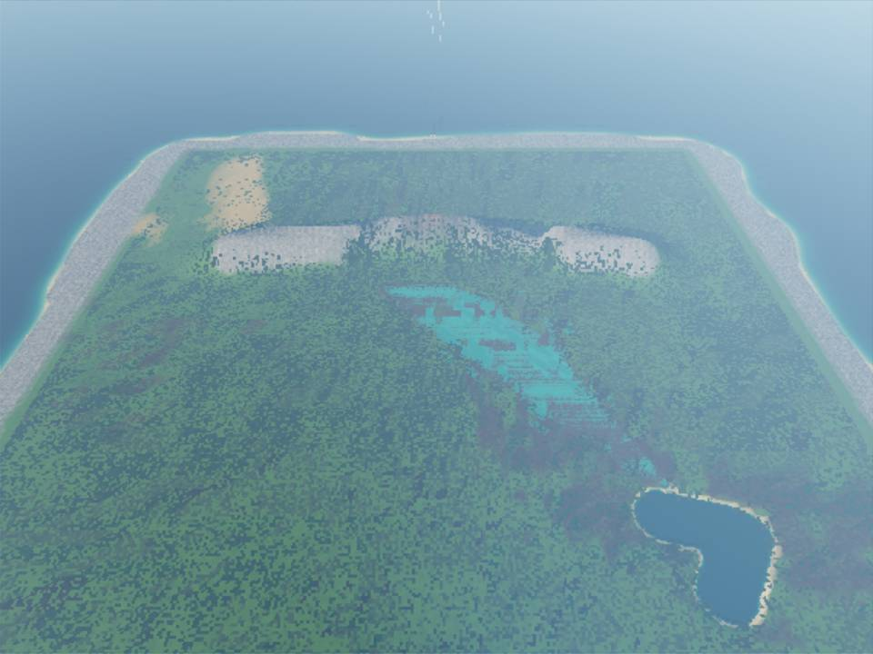
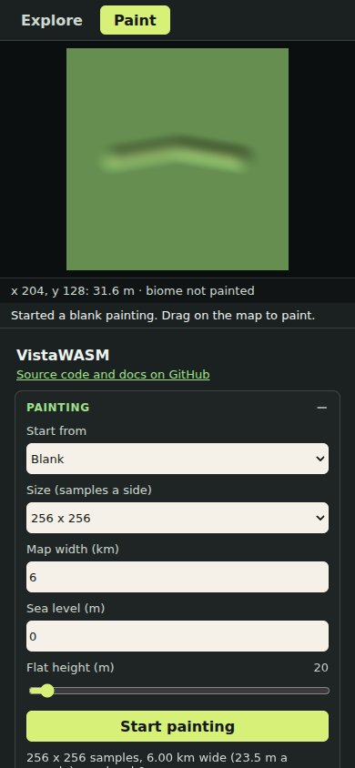

# The demo

The demo is a plain static site in `demo/`, with no build step. Run it
with `npm run dev`, or build a copy to host with `npm run build:demo`.
It has two tabs: **Explore**, the 3D view with every engine control, and
**Paint**, a 2D editor for heightmaps, biomes, water and vegetation.

## Opening view

The demo opens on the **Meandering lowland** preset, standing at the
water's edge of its 60 m³/s river and looking downstream, with a low
sun behind the camera. **Generate terrain** builds a map from the terrain
controls. When the new map is smaller and leaves the camera beyond its
edge, the camera moves 150 m above the map and looks across it. When
new terrain would put the camera inside a hill, it is lifted clear of
the ground and keeps looking the same way. After a preset, **Generate terrain**
sets the river inflow back to automatic, since the preset placed its
inflow for its own map.

## Overlays and shortcuts

The **View** section at the top of the side panel shows and hides what
sits over the 3D view:

| Key | Shows or hides |
| --- | --- |
| `1` | The stats and FPS panel |
| `2` | The minimap |
| `3` | The controls hint |
| `4` | The status line, with the seed and generation times |
| `0` | The whole side panel |

- Hidden overlays get the `hidden` attribute, so screen readers skip
    them too. Hidden stats skip building their text each frame.
- With the side panel hidden, the view takes the full width and a
    **Show controls** button stays in the top right corner. `0` brings
    the panel back too.
- An error brings a hidden status line back, so it is never missed.
- The keys do nothing while you type in a field, a select or a text
    area, and never clash with the camera keys (WASD, Space and Shift).
- The choices are remembered in `localStorage`. On a screen under 700 px
    wide, the panel starts hidden.

## Loading

A loading panel covers the view while the engine starts, and while
terrain generates or a map imports:

- A progress bar runs through the generation phases: raising the land,
    tracing drainage, adding detail, eroding, carving rivers and lakes,
    and growing the forests and building the mesh. It never moves back.
    The phase shares live in `demo/src/loading.js`.
- Some phases run in WASM without giving the page a chance to redraw, so
    the bar can pause on one phase. A shimmer across it keeps moving
    regardless, because it animates on the compositor.
- A rebuild that finishes within about a tenth of a second never shows
    the panel.
- If loading fails, for example without WebGPU, the panel shows the error
    with a **Close** button, and the status line keeps it.

## Tabs

The tab bar above the view follows the ARIA tabs pattern: the arrow
keys, Home and End move between the tabs.

- **Paint** stops the 3D loop, so the GPU is idle while you paint, and
    detaches the fly camera, so the paint keys never move it. The side
    panel shows the paint tools; the Explore controls stay in the page,
    hidden, and keep their values.
- **Explore** restarts the loop with the camera where you left it, or
    framing a painting you rendered.

## Painting



### Starting a painting

Choose a size (256, 512 or 1024 samples a side) and where to start from,
then press **Start painting**:

- **Blank:** flat ground at a height from 0 to 500 m, with a map width in
    kilometres and a sea level. Nothing is painted.
- **Current map:** the heights of the terrain in Explore before rivers,
    lakes and glaciers carved it (`exportMap("sourceHeight")`),
    resampled to the painting's size. **Copy generated biomes** fills the
    biome layer with the biomes the engine classified. Painted maps the
    engine already has are copied too.
- **Import files:** a heightmap image (PNG, JPEG or WebP, with its lowest
    and highest height; a 16-bit PNG from an export fills these in),
    and optionally a biome map, a water mask and tree and grass density
    masks. Or a bundle (`.zip`), which loads its source heights and
    painted maps.

Files are checked before anything decodes them, here and in Explore's
import and texture controls (the checks live in `demo/src/file-checks.js`):

- Images must be PNG, JPEG or WebP, at most 160 MB. Heightmap images
    and painted maps are 2 to 2048 pixels a side, the largest terrain
    (set by WebAssembly's memory); texture images 2 to 8192.
    The size comes from the image's header, so an oversized image is
    refused before the browser decodes it.
- Bundles must be `.zip` files of at most 512 MB. `loadBundle()` then
    inflates at most 1 GB of files.

A refused file leaves the scene as it was, and a message beside the
control or in the status line says why and what to choose instead.

### Layers

A painting holds five layers, each N x N samples:

| Layer | Values | Goes to |
| --- | --- | --- |
| Height | metres | `loadRawHeightmap()` |
| Biome | a biome index, or 255 for not painted | `setBiomeMap()` |
| Water | 0 none, 1 to 127 a river's strength, 128 to 255 a lake | `setWaterMask()` |
| Trees | 0 none, 128 unchanged, 255 twice as dense | `setVegetationMasks()` |
| Grass | as trees | `setVegetationMasks()` |

The view shows the height as hillshade, lit from the sun set in Explore,
times colours by height. The **Layers and view** section tints the biome
colours, water, and tree and grass density over it, and sets the height
range the colours span.

### Brushes

Every brush has a **size** from 1 to 256 samples, a **strength** from 0
to 1 and a **falloff**: smooth, linear or constant. A stroke places a
dab every quarter of the brush's radius. A pen's pressure scales the
strength. `[` and `]` shrink and grow the brush.

| Tool | What a dab does |
| --- | --- |
| Raise, Lower | Moves the ground 2 m for every 100 m of the colour range, times strength and falloff |
| Smooth | Blends towards a 5 x 5 Gaussian of the neighbourhood |
| Flatten | Blends towards the height where the stroke started |
| Noise | Adds fractal noise of up to 10 m times strength, with a wavelength tied to the brush size |
| Erode | Three passes of thermal erosion to a 35 degree slope, then 30 droplets that carve valleys and leave scree; it moves soil without adding or removing any |
| Paint biome | Sets the chosen biome where the falloff is at least 0.5, as categories don't blend. **Erase** marks samples not painted |
| Lake | Sets 200 (a lake) where the falloff is at least 0.5 |
| River | Sets the strength mapped to 1 to 127; rivers start at size 3 |
| Erase water | Sets 0 |
| More, fewer, reset trees and grass | Moves the density towards 255, 0 or 128 |

Each tool keeps its own size. The biome brush shows a palette of every
biome, in the colours of the exported biome map.

### Navigating

- Scroll or pinch to zoom, from 0.25 to 8 screen pixels a sample.
- Hold Space and drag, drag with the middle button, or drag with two
    fingers to pan. **Fit** fits the painting to the view.
- A second finger turns a stroke into a pinch, and the stroke is undone.
- The line under the view reads the height, biome, water and density
    under the pointer.

### Undo and redo

**Undo** and **Redo**, or Ctrl or Cmd + Z, and Ctrl or Cmd + Shift + Z or
Ctrl + Y. The history keeps the 64 x 64 tiles each stroke changed, as
they were before and after it: up to 100 strokes or 256 MB, dropping the
oldest first. Starting or opening a painting clears it.

### Rendering in 3D

**Render in 3D** loads the height layer with `loadRawHeightmap()`, sets
the painted biome, water and density maps (or clears them where nothing
is painted), switches to Explore and frames the map from 45 degrees, 0.8
map widths away. The painting's sea level becomes the water's. Warnings
from the engine appear in the status line.



**Render after each stroke** renders 600 ms after a stroke ends, while
you keep painting. The 3D view stays hidden, and Explore shows the
result as soon as you switch to it. If a render is running when another
is due, only the latest waits.

### Saving, opening and exporting

- **Save painting (.zip)** writes a version 2 bundle with
    `exportBundle()`: the source heights, the painted maps and the
    options. It renders first if the painting has changed.
- **Open painting (.zip)** loads a bundle with `loadBundle()` and reads
    its heights and painted maps back into the layers. It keeps the
    Explore settings as they are.
- **Export layer as PNG** writes one layer with `encodePng()`: the
    height as a 16-bit grey PNG that keeps its range, biomes in the
    exported legend colours, and water and densities as grey values.
    **Import files** reads each of them back unchanged.

## On phones



On a narrow screen the view sits above the panel, which starts hidden.
Painting uses Pointer Events with coalesced events, so a finger or pen
draws smooth strokes, and the paint canvas takes every touch, so
dragging on it never scrolls the page.

Brush work runs in animation frames with a budget of 8 ms: the dabs a
frame cannot fit wait for the next, so a fast stroke may finish a moment
after you lift your finger, but the page keeps its frame rate. An erode
dab runs in four parts (its three thermal passes and its droplets),
which may fall in different frames, with the same result. The
**Render** section shows the last stroke's cost: milliseconds a dab, and
brush and redraw time a frame.

## Checking the demo

`scripts/visual-check/demo-capture.mjs` drives the demo in headless
Chromium with software WebGPU. It presses the overlay keys, paints and
renders a painting, undoes, saves and reopens it, starts from each kind
of source, paints with touch on a phone-sized page, and times strokes
with the CPU slowed four times. See the header of the script.

```sh
npm run build:demo
python3 -m http.server 8124 &
node scripts/visual-check/demo-capture.mjs /tmp/demo-capture
```

## Content Security Policy

`demo/index.html` sets its policy in a `<meta http-equiv>` tag:

```text
default-src 'self'; script-src 'self' 'wasm-unsafe-eval' 'sha256-…'; object-src 'none'; base-uri 'none'; form-action 'none'
```

Everything loads from the page's own origin. `'wasm-unsafe-eval'` lets
the engine compile its WASM, and the hash admits the inline import map,
the only inline script. The page uses no inline styles: the biome
legend's colours are in `style.css`. `npm run build:demo` checks the hash
against the import map and stops with the right hash if they differ, so
change both together. The same policy works under `npm run dev`.

The vanilla example's production build
(`npx vite build --config vite.config.ts examples/vanilla`) gets the same
policy without the hash from a small plugin in `vite.config.ts`. Its dev
server injects styles inline for hot reloading, so the tag goes into
built pages only.
