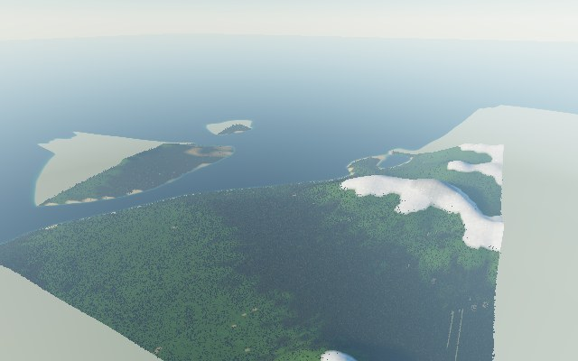
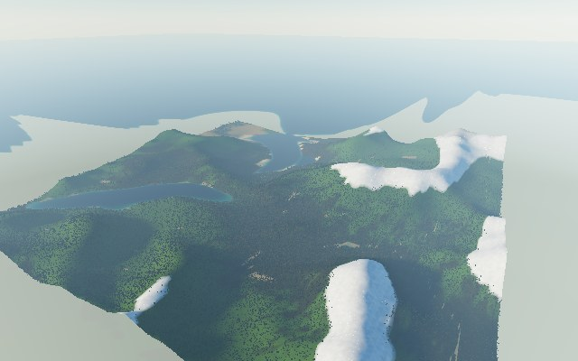
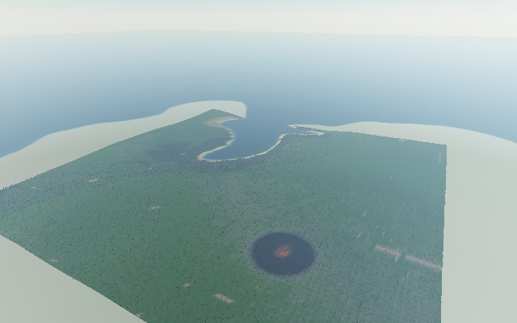
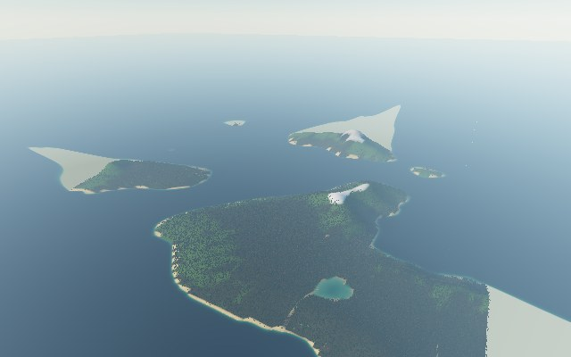
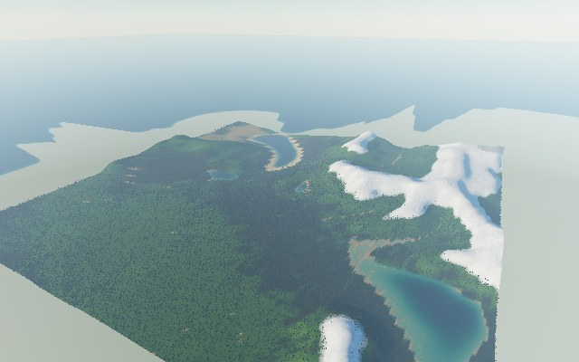
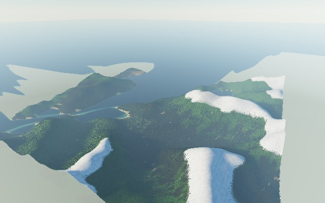
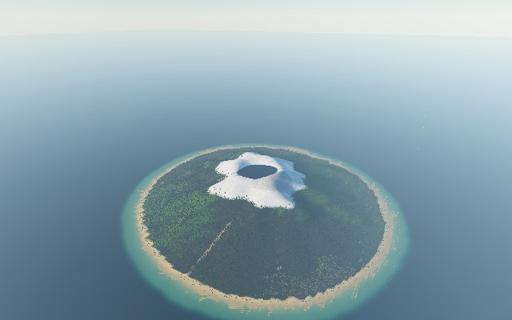

# Terrain Data: Generation, Import, and the Data Model

VistaWASM gets its heightmap from exactly one of three sources per engine
instance: procedural fractal generation, a GeoTIFF DEM, or a raw heightmap
buffer. This document covers the data model shared by all three and the
precise scope of each import path. For *how to make fractal terrain look
good creatively*, see
[`docs/world-design-guide.md`](world-design-guide.md); this document is the
data/format reference.

## The shared data model

Every generation/load call returns a `TerrainHandle`:

```ts
interface TerrainHandle {
  id: number;
  metadata: TerrainMetadata;
}
```

`id` is a stable handle for the *current* engine instance (it increments on
each new terrain, so you can detect a stale reference, but it is not a
global/cross-session identifier). `metadata` is the important part — see
the full field table in
[`docs/options-reference.md`](options-reference.md#terrainmetadata-on-terrainhandlemetadata).
Three things worth calling out specifically:

- **`minHeightMetres`/`maxHeightMetres`/`meanHeightMetres` are the real,
  measured height range of what was actually generated or decoded** — not
  an echo of a requested parameter. Always read these back rather than
  assuming e.g. `verticalScale: 1` means "heights range -1 to 1 metres";
  use them to place a camera or set `WaterOptions.seaLevelMetres` (see
  [`docs/water.md`](water.md#sea-level)).
- **`warnings` is a plain `string[]` of non-fatal issues** encountered
  during decode/generation — surface these to a host UI (or at least log
  them) rather than silently discarding them. A DEM missing recognised
  geospatial tags, for example, produces a warning rather than a hard
  failure, since VistaWASM can still render the heights.
- **`geospatial` is only populated for GeoTIFF sources** with recognised
  tags — it is `null` for fractal generation and raw heightmaps.

Only one terrain is active per engine at a time. Generating or loading a
new one fully replaces the previous one (and re-triggers flora/grass/water
placement — see [`docs/architecture.md`](architecture.md#rendering)); there
is no multi-terrain or terrain-streaming support (see
[`docs/game-development.md`](game-development.md#4-multiple-terrains-streaming-worlds-and-world-size)
for how to work within this for large worlds).

## Fractal generation

`engine.generateFractal(options: FractalTerrainOptions)` is deterministic
Rust for a given `seed` and option set. It shapes land the way geology and
water do: continents first, then uplifted ranges carved by rivers, then
detail, then erosion. It runs in four stages:

1. **Tectonics** (`terrain/tectonics.rs`, coarse grid). Continents come
    from warped low-frequency gradient noise, thresholded so exactly
    `landform.landFraction` of the map is land. With `edges: "coast"`
    they first sink into the sea over a rim at the border (see
    [Map edges](#map-edges)). Mountain ranges are an
    uplift field of warped ridged noise, confined to a belt within the land
    and faded in from the coast. `"continental"`, `"alpine"` and
    `"fjords"` belts also stand on a broad massif that rises from the
    coast, so their valleys lie high, as in real mountain ranges; stream
    power carves the massif together with the ranges.
2. **Drainage** (`terrain/stream_power.rs`, coarse grid). An implicit
    stream-power solver (Braun and Willett, 2013) carves the ranges until
    erosion balances uplift, which leaves a dendritic valley network with
    ridge spurs. Lowlands erode for a shorter time, so they keep their
    gentle relief. Valleys then get flat floors; under ice they become
    U-shaped troughs, and the deepest reach below sea level as fjords.
3. **Detail** (`terrain/fractal.rs`, full resolution). The coarse grid is
    upsampled bicubically and derivative-damped fBm adds detail. Detail is
    strongest on steep ground in the ranges and fades out on level ground.
    `NoiseOptions` controls this layer, and `TerrainShapeOptions` applies
    after it.
4. **Erosion** (`ErosionOptions`, optional, full resolution). Virtual-pipe
    hydraulic erosion cuts gullies and builds alluvial fans; thermal
    erosion leaves scree below cliffs. See [Erosion](#erosion).

Finally, summits less than 0.3 samples' spacing above their col are
levelled, specks of land under 6 samples are drowned, and closed pits
under 24 samples are filled, so the map drains to the sea or to lakes.

The coarse grid is at most 256 samples per side and never finer than 40 m
per sample. Its upstream drainage area is kept with the terrain for rivers
and later stages.

Heights are in metres. The coast sits at `seaLevelMetres`; `verticalScale`
stretches heights about sea level, and `baseHeightMetres` then raises or
sinks the whole map.

`generateFractal()` reports each stage through the `"progress"` event:

```ts
engine.on("progress", ({ phase, progress }) => {
  status.textContent = `${phase}: ${Math.round(progress * 100)} %`;
});

await engine.generateFractal({
  seed: 7,
  size: 512,
  horizontalScaleMetres: 12,
  verticalScale: 1,
  noise: { kind: "ridged", octaves: 7, gain: 0.5, lacunarity: 2 },
  landform: "alpine",
  erosion: { quality: "high" }
});
```

The phases are `"tectonics"`, `"drainage"`, `"detail"`, `"erosion"` (at
least every 10 %) and `"finishing"` (conditioning the map, then building
rivers, flora and the terrain mesh), between `"fractal"` events at 0 and 1.

See [`docs/world-design-guide.md`](world-design-guide.md#1-the-generation-pipeline-in-order)
for the creative walkthrough, and
[`docs/options-reference.md`](options-reference.md#fractalterrainoptions)
for every field.

### Landforms

`FractalTerrainOptions.landform` picks the character of the map. It
defaults to `"continental"`. Every preset sets the land fraction, the size
of continents and ranges, relief, erodibility, rain, talus angle, and
whether ice carves the valleys.

| Landform | Character |
| --- | --- |
| `"continental"` | Mixed plains, hills and one or two ranges. 70 % land, ranges up to 1400 m. |
| `"alpine"` | High, heavily eroded ranges with deep valleys and glacial lakes. 95 % land, up to 2600 m. |
| `"rollingHills"` | Gentle downs and broad vales with no ranges, and nothing steeper than 30 degrees. |
| `"archipelago"` | Many islands of varied size. 35 % land. |
| `"mesaDesert"` | Terraced plateaus, buttes and canyons under a dry climate. |
| `"fjords"` | Steep ranges cut by U-shaped glacial valleys that the sea floods. |
| `"volcanicIsland"` | A central cone with a crater lake, radial gullies and a reef shelf. |

Features have a real size in metres, so a larger map holds more of them.
On a small map, continents shrink to at most 1.5 times the map's width and
ranges to at most 0.6 times, and relief shrinks with them, so a small map
still holds a coherent coast and range. Each landform's ranges stand at
most a set fraction of their width (see
[`docs/options-reference.md`](options-reference.md#landformkind)): on a
512 x 512 map at 12 m, alpine ranges rise to 1,500 to 2,000 m with snowy
peaks, and fjord walls to 1,100 to 1,700 m. On a map that small and ringed
by sea, an alpine map forms one high massif, cut by glacial valleys and
cirque lakes, rather than several separate ranges.















Each image is seed 1 at 512 x 512 and 12 m per sample, with `"high"`
erosion.

### Map edges

`FractalTerrainOptions.edges` decides what happens at the map's square
edge:

- `"coast"` (the default) rings the land with sea. Over a rim along the
    border, 6 % of the map's width (at least 300 m) and up to 4 % more
    where noise widens it, the continents sink into the sea. The coast
    wanders in bays and headlands, and drainage and erosion see the sea,
    so rivers reach it. Each landform keeps its land fraction; land-filled
    landforms such as `"alpine"`, `"rollingHills"` and `"mesaDesert"` keep
    their inland character, with the coast only a rim at the border. The
    sea shelves to a third of the landform's sea floor at the border
    itself.
- `"open"` lets the land run to the edge, as the generator did before
    1.1.0. Use it when you place several maps side by side.

Past the map's edge, every terrain continues as a skirt that descends
into the sea; see [Beyond the map edge](#beyond-the-map-edge).

```ts
// A map to tile with its neighbours: no coast at the edge.
await engine.generateFractal({
  seed: 7,
  size: 512,
  horizontalScaleMetres: 12,
  verticalScale: 1,
  noise: { kind: "ridged", octaves: 7, gain: 0.5, lacunarity: 2 },
  landform: "alpine",
  edges: "open"
});
```

### Beyond the map edge

Every terrain, generated, DEM or raw, continues past its edge as a skirt,
so the world never ends in a wall:

- Over the first 1,500 m (`SKIRT_METRES`), the ground falls from the
    edge's height to 60 m below the terrain's sea level along a smooth
    curve, varied by gentle noise by up to 15 % of the drop. An edge that
    is already deeper keeps its depth.
- Beyond that the sea floor keeps sloping gently down, so the open ocean
    reads as deep water with a real coast on the skirt.
- The skirt turns to rock over its first 300 m, and to sand below the
    waterline. Snow lying at the edge stays on it, so a frozen map ends
    in snow, not bare rock. No trees or grass grow on it.

With `edges: "coast"` the skirt meets sea along the border. With
`edges: "open"`, or an imported map whose land reaches its edge, the land
slopes down into the sea beyond the edge. The terrain mesh builds the
skirt 4.5 km out, where the sea floor lies 300 m deep and water hides it
(unless `WaterOptions.clarityMetres` is above about 260 m). The water
shader uses the same skirt for its depth, so shallows, surf and foam line
up with the mesh's shore.

### Determinism

The same `seed` and options **always** produce the same heights on the
same build: the engine's test suite checks this bit for bit
(`crates/vista_wasm/tests/deterministic_terrain.rs` and
`terrain/realism_tests.rs`). Native and browser builds can differ in the
last bits, since maths functions such as `pow` and `ln` round differently
across platforms, and GPU erosion orders its arithmetic differently from
the CPU reference. `seed` shapes the terrain only. Flora, grass,
clouds, mist, biomes, and weather each have their own `seedOffset`; save
those as well to reproduce a whole scene.

The same seed produced a different map before 1.1.0: the generator was
rebuilt around landforms. `TerrainMetadata.generatorVersion` records
`vistawasm-fractal-0.2.0` for the new generator.

### Erosion

Pass `erosion` to erode the map; omit it to skip erosion. Unset fields take
the landform's defaults (rain and talus angle), and unset iteration counts
follow `quality`.

Erosion runs as GPU compute passes on browser builds
(`render/erosion_compute.rs`, `shaders/hydraulic_erosion.wgsl` and
`shaders/thermal_erosion.wgsl`). If the GPU pass fails, generation falls
back to the CPU reference in `terrain/erosion.rs`, so it always produces a
result. Native and test builds use the CPU path. Both run the same passes
with the same constants. They can differ in the last bits, because
floating-point operations run in a different order.

Each hydraulic iteration runs six passes of the virtual-pipe shallow-water
model (Mei, Decaudin and Hu, 2007):

1. Rain, weighted towards valleys with a large drainage area.
2. Outflow through four virtual pipes to each neighbour.
3. Water depth and velocity.
4. Erosion and deposition towards the sediment capacity
    `C = Kc * sin(slope) * |v| * limit(depth)`. Water on level ground only
    deposits, so valley floors aggrade and fans form where valleys open out.
5. Sediment advection, which conserves sediment.
6. Evaporation.

Thermal iterations move material downhill wherever the slope between two
neighbours exceeds the talus angle, which leaves scree below cliffs, plus a
slow soil creep. 60 % of the iterations run at half resolution, where large
features settle cheaply, and the rest at full resolution, where fine
gullies form. The sea and the map edge carry water and sediment away.

`quality` sets default iteration counts and caps requested ones:

| `quality` | Default hydraulic, thermal | Cap per pass |
| --- | --- | --- |
| `"preview"` (default) | 60, 30 | 120 |
| `"balanced"` | 120, 60 | 240 |
| `"high"` | 200, 100 | 400 |
| `"offline"` | 400, 200 | 5000 |

Use `"preview"` to keep a UI responsive while sliders move, and `"high"`
for the final terrain (the demo's default). On a mid-range GPU, the
erosion stage is a small part of a generation, even at `"high"`.
`RenderQualityOptions.preset` does not affect erosion.

## DEM import (GeoTIFF)

```ts
const response = await fetch("/terrain/yosemite.tif");
const buffer = await response.arrayBuffer();

const handle = await engine.loadDemFromArrayBuffer(buffer, {
  verticalScale: 1,
  generateNormals: true,
  generateMaterialMasks: true
});
```

Or, if the fetch itself should go through VistaWASM's own error handling:

```ts
const handle = await engine.loadDemFromUrl("/terrain/yosemite.tif");
```

`loadDemFromUrl()` is a thin convenience wrapper: it fetches the URL (using
the `fetch` options in `DemFetchOptions` — `headers`, `signal`) and passes
the resulting bytes to `loadDemFromArrayBuffer()`. Configure CORS on the
serving origin if it differs from your app's origin.

### Exactly what is supported

VistaWASM decodes a **deliberately scoped subset** of GeoTIFF, not the full
format:

- Classic TIFF only (magic value `42` — not BigTIFF).
- **Uncompressed data only.** Any `Compression` tag value other than `1`
  (none) is rejected with `DEM_FORMAT_UNSUPPORTED`. Re-export your DEM
  without compression (e.g. `gdal_translate -co COMPRESS=NONE`) if you hit
  this.
- **One sample per pixel only.** Multi-band GeoTIFFs (e.g. RGB plus a
  separate elevation band) are rejected — extract the elevation band to
  its own single-band file first.
- **Strip-based storage** (not tiled). A tiled file has no strip tags, so
  it fails with `DEM_METADATA_MISSING`. Most DEM exports use strips by
  default; re-export without tiling if needed.
- 16-bit or 32-bit integer (signed or unsigned), or 32-bit float samples.
- Reads `ModelPixelScaleTag` and `ModelTiepointTag` for geospatial scale,
  `GeoKeyDirectoryTag` presence (recorded, not fully interpreted — see
  `GeospatialMetadata.projectionName`), and GDAL's non-standard no-data tag
  (`42113`) when present.

Anything outside this scope throws a `VistaWasmError` with code
`DEM_FORMAT_UNSUPPORTED` or `DEM_METADATA_MISSING` (see
[`docs/events-errors-and-lifecycle.md`](events-errors-and-lifecycle.md#error-codes)
for the full list) rather than attempting a best-effort partial decode.

### No-data handling

Samples matching the GDAL no-data value (or otherwise flagged during
decode) are tracked in a separate mask, not silently substituted with `0`
or clamped into the height range — this is what `DebugView`'s planned
`"no-data"` overlay is for (see
[`docs/render-quality-and-diagnostics.md`](render-quality-and-diagnostics.md#debug-views-debugview),
noting that overlay is not implemented yet). Flora and grass placement
already skip no-data samples automatically.

## Raw heightmap import

For pre-processed height data with no DEM metadata at all:

```ts
await engine.loadRawHeightmap(buffer, {
  width: 1024,
  height: 1024,
  sampleFormat: "float32",
  metresPerSample: 30,
  heightScaleMetres: 1,
  noDataValue: -9999
});
```

See [`docs/options-reference.md`](options-reference.md#rawheightmapoptions)
for every field. This path has no geospatial metadata concept at all
(`TerrainMetadata.geospatial` is always `null`), and is the right choice
for heightmaps you've already processed yourself (e.g. exported from
another tool, or generated offline) rather than a DEM you want VistaWASM to
parse.

## Choosing a source

| | Fractal | GeoTIFF DEM | Raw heightmap |
| --- | --- | --- | --- |
| Determinism | Fully seeded/reproducible | Whatever the source file contains | Whatever the source buffer contains |
| Real-world accuracy | No — procedural | Yes, for supported files | Only if your own pre-processing preserved it |
| Setup cost | None — just call `generateFractal()` | Needs a compatible, uncompressed, single-band file | Needs you to already have raw samples in a supported format |
| Geospatial metadata | None | Partial (scale/tiepoint/no-data) | None |

Most projects use fractal generation for procedural worlds and DEM import
for real-world locations; raw heightmap import is mainly for
already-processed or non-GeoTIFF pipelines.
